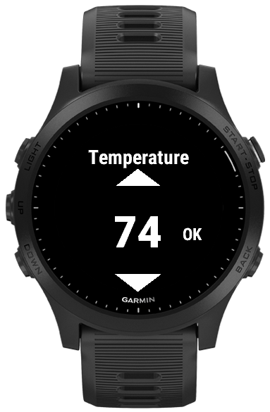
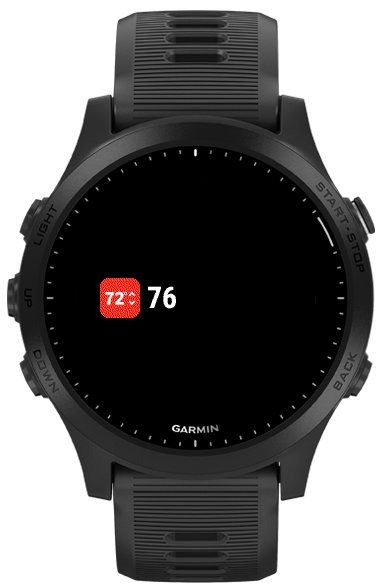

This is Garmin Connect IQ widget to control Honeywell thermostats through the Total Connect Comfort web API.

The widget can get and set the current cool setpoint.

Garmin devices cannot parse `text/xml` responses (probably intentionally).
The Total Connect Comfort responses are exclusively `text/xml`.
Therefore, this widget connects to a companion MITM (man-in-the-middle) service which converts the responses to JSON.